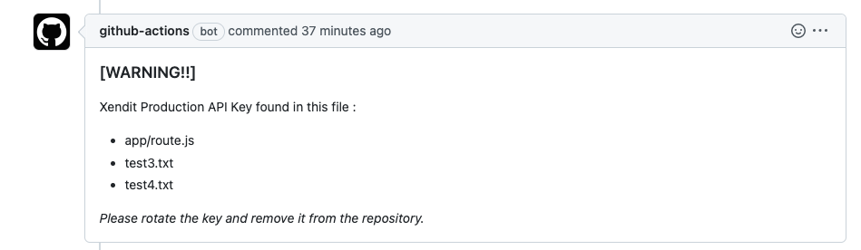

# Xendit API Key Scanner
Xendit API Key Scanner is a Github action to detect Xendit API Key in the pull request.
The action will fail if there is any detected Xendit API Key in the changed code in a spesific pull request. The action will give the detail path in Pull Request Comment. 

Example of PR Comment : 


## Inputs 
- `github-token` (Optional) Github token to create PR Comment. By default using github token provided by github action.

## How to use
1. Create config inside `.github/workflow` folder.
example config : 
```
name: 'Test - Xendit API Key Detector Action'

on: pull_request
jobs:
  scan_job:
    runs-on: ubuntu-latest
    name: Xendit API Key Detector Action
    steps:
      - name: Scan Job
        uses: xendit/xendit-api-key-scanner-action@v1.0.0
```
using custom `gihtub-token` input (optional) :
```
name: 'Test - Xendit API Key Detector Action'

on: pull_request
jobs:
  scan_job:
    runs-on: ubuntu-latest
    name: Xendit API Key Detector Action
    steps:
      - name: Scan Job
        uses: xendit/xendit-api-key-scanner-action@v1.0.0
        with:
          github-token: <github-token>
```
2. Create pull request to test the action

## Limitation

1. Only detect in the Pull Request trigger

## Contributing

Running test suite
```bash
npm install
npm run test
```
Run before open pull request
```bash
npm run prepare
```
For any requests, bug or comments, please [open an issue](https://github.com/xendit/xendit-api-key-scanner-action/issues) or [submit a pull request](https://github.com/xendit/xendit-api-key-scanner-action/pulls).